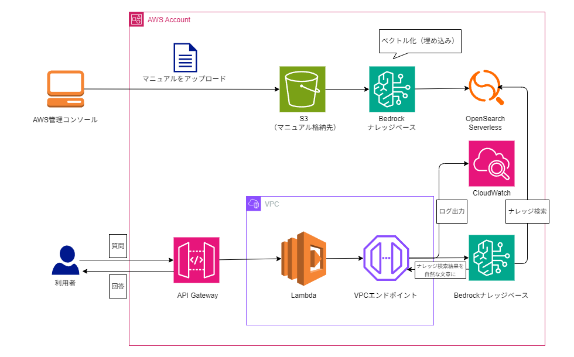

# AWS ハンズオン：Knowledge Base API セットアップ

このプロジェクトは、Amazon Bedrock Knowledge Base を活用した API サービスのハンズオン用リポジトリです。  
API Gateway、Lambda、S3、OpenSearch Service などを連携し、ナレッジベース検索を実装します。
紹介記事：[RAG構成で実現！Bedrockナレッジベースを活用した生成AI APIの作り方 -CloudFormationテンプレート付き-](https://tetete-home.com/article/1250)

---

## 📦 前提条件

- Node.js 22.x
- AWS アカウントおよび IAM 権限
- AWS CLI セットアップ済み
- `.env` ファイルを手動で作成（詳細は後述）
- 以下のS3バケットが作成済み
  - DEPLOY_BUCKET（Lambda関数のソースを格納するバケット）
  - MANUAL_BUCKET（マニュアルを格納するバケット。ドキュメントが格納済み）

---

## 🗺️ 環境構成


---

## 🛠️ セットアップ手順

### 1. リポジトリをクローン

```bash
git clone https://github.com/TeTeTe-Jack/aws-handson-knowledgebase-api.git
cd aws-handson-knowledgebase-api
```

### 2. .env ファイルを手動で作成
プロジェクトのルートディレクトリに .env ファイルを作成し、以下の内容を記述してください。
```env
# リージョンの指定
AWS_REGION=ap-northeast-1

# プロジェクト名（各リソースのプレフィックス）
PROJECT_NAME=my-kb-project

# バケット名（Lambda関数のソースの格納バケット）
DEPLOY_BUCKET=my-kb-deploy-bucket
# オブジェクトキー（Lambda関数のソースのオブジェクトキー）
LAMBDA_SOURCE_ZIP_KEY=kb-api/kb-api.zip

# バケット名（ナレッジベースに登録するドキュメントの格納バケット）
MANUAL_BUCKET=my-kb-manual-bucket
# オブジェクトのプレフィックス（ナレッジベースに登録するドキュメントのプレフィックス）
KNOWLEDGEBASE_PREFIX=manual/

# ナレッジベースに登録する際に利用する埋め込み基盤モデル
EMBEDDING_MODEL=amazon.titan-embed-text-v1

# VPCのサブネット数
AZCOUNT=1

# OpenSearch ServerlessマルチAZ対応設定（ON: マルチAZ、OFF: シングルAZ）
OPENSEARCH_SERVERLESS_MAZMODE=OFF

# CloudWatchログの保持期間（日）
LOGRETENTION_DAYS=7

```

- DEPLOY_BUCKET と MANUAL_BUCKET は他と重複しないS3バケット名にしてください
- 必要に応じてリージョンやプロジェクト名を変更可能です

### 3. 依存パッケージのインストール
```bash
npm install
```

### 4. デプロイ・ビルド・その他の操作
必要に応じて以下のコマンドを使用してください。
|コマンド|説明|
|---|---
|npm run build|TypeScript のビルド|
|npm run zip|TypeScript のビルド後にzip化|
|npm run upload|zip化したソースコードをS3にアップロード|
|npm run deploy|AWS へのデプロイ（CloudFormationでリソース配備）|
|npm run sync|Knowledge Baseの同期|
|npm run test|デプロイしたAPIのテスト|
|npm run update|Lambda関数のソースの最新化|
|npm run delete|デプロイした環境の削除|

※ 実際のスクリプトは package.json の内容に応じて定義してください。

## 📁 ディレクトリ構成
```bash
aws-handson-kb-api/
├── scripts/            # セットアップや補助スクリプト
├── lambda/             # Lambda 関数などのソースコード
├── cfn/                # CloudFormation（CFn） テンプレート類
├── .env                # 手動作成（Gitには含めない）
├── .gitignore
├── package.json
├── package-lock.json
├── tsconfig.json
└── README.md

```